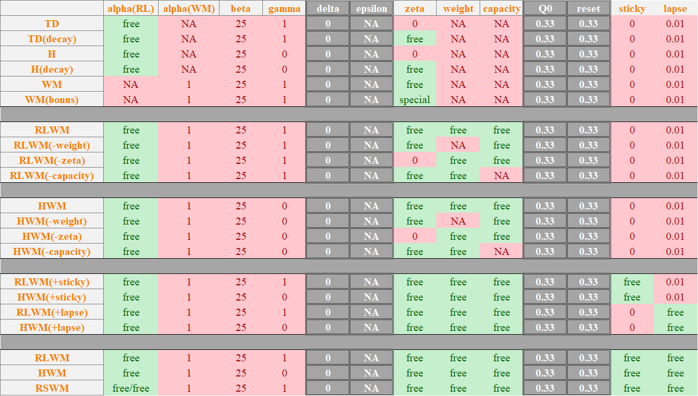
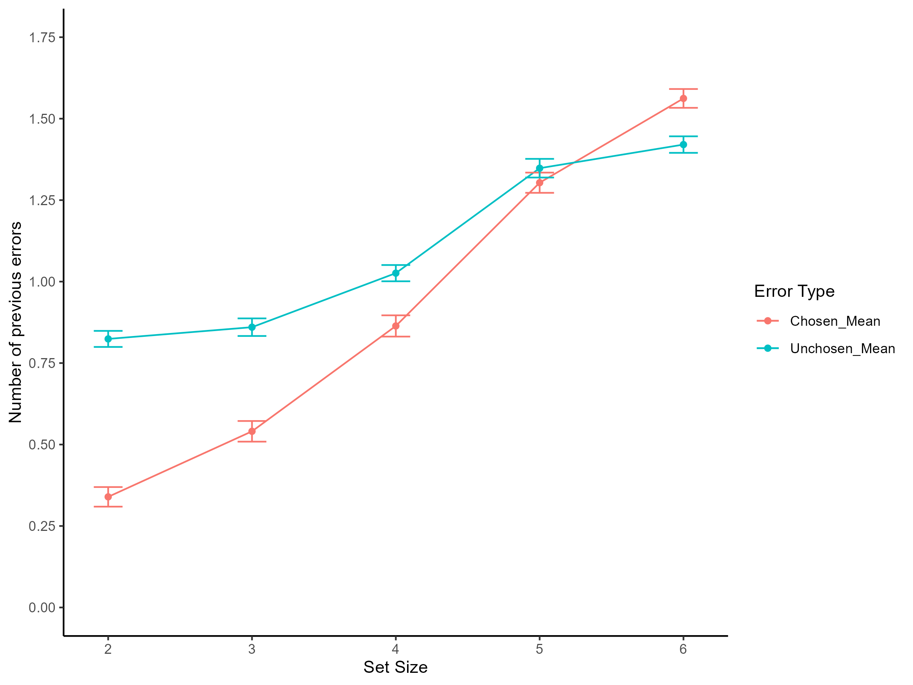
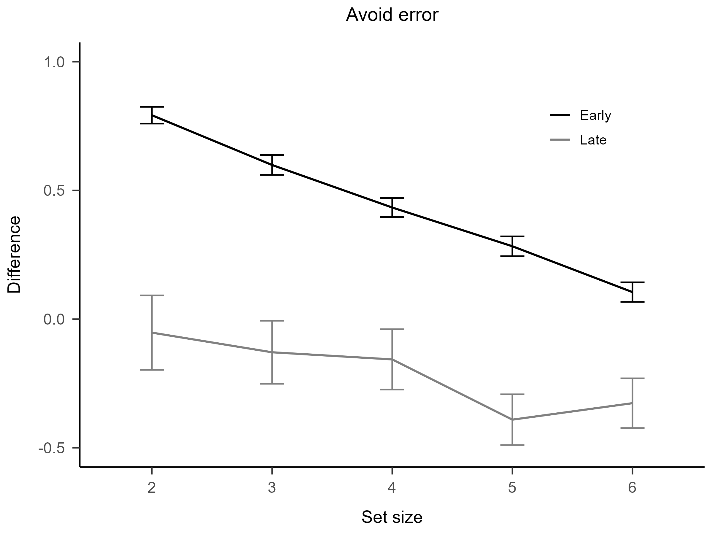
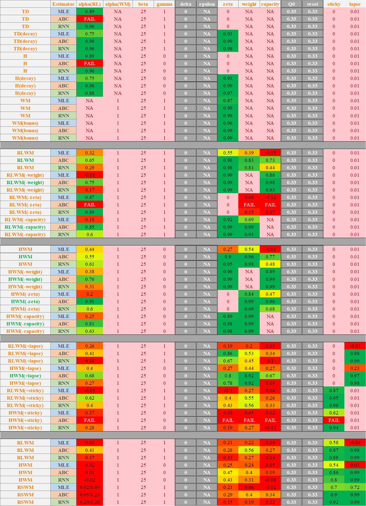

## A Remake of RLWMH

I am a huge fan of Anne G. E. Collins. This repository is a fork of [Collins (2025)](https://doi.org/10.1038/s41562-025-02340-0). (`./RAW`: Contains all original assets, data, and MATLAB scripts from the parent repository)

I will remake the models using my own R package, `multiRL`, guided by my personal understanding of the original MATLAB implementation.

Any novel findings or insights discovered during this process will be documented in this README.

## Padadigm
[Dataset 1](https://github.com/yuki-961004/RLWMH/tree/main/RAW/RLWM/DataSets) is from [Collins and Frank (2012)](https://doi.org/10.1111%2Fj.1460-9568.2011.07980.x)

```
+------------------------------+
|        Computer Screen       |
|                              |
|       +-------------+        |
|       |             |        |
|       |   Stimulus  |        |
|       |    Image    |        |
|       |             |        |
|       +-------------+        |
|                              |
|                              |
|        [J]  [K]  [L]         |
|        Response Keys         |
|                              |
+------------------------------+
```

In each trial, an image is presented, and participants choose between **three different response keys**. A **correct** response results in a **reward of 1**, whereas an **incorrect** response yields a **reward of 0**. The working memory load scales up across blocks as the **set size** (number of stimuli) increases.

## Model

<p align="center">
    
</p>

**Note**
1. Since any number raised to the power of zero is one, the H-agent model can be conceptualized as a utility function under Stevens' Power Law where the exponent `gamma` is fixed at `0`.
2. Upper-Confidence-Bound cannot be applied to this paradigm, so `delta` needs to be fixed at `0`. Since there are only three actions (J, K, L) for each image, once the correct option is found, there's no need to explore the others.
3. Each block features a new image, so we need a `reset`. With only three options available, the initial Q-value (`Q0`) and the `reset` value should both be `0.33`.
4. Since we aren't learning the expected value of a bandit, the inverse temperature parameter should be quite high. I suggest setting the `rate` to `0.1` and the search range is `(0, 50)`.
5. Technically, picking the correct option should reset the values of all other choices to zero. But since removing this `bonus` didn’t really affect the behavioral plots, I eventually decided to drop it to keep the model simpler.

---

### Target Experiment Effect

<p align="center">
    
    
    
</p>

### Recoverability

<p align="center">
    
</p>

#### SetSize Effect

#### Error Effect

#### Avoid Effect


