## A Remake of RLWMH

I am a huge fan of Anne G. E. Collins. This repository is a fork of [Collins (2025)](https://doi.org/10.1038/s41562-025-02340-0). (`./RAW`: Contains all original assets, data, and MATLAB scripts from the parent repository)

I will remake the models using my own R package, `multiRL`, guided by my personal understanding of the original MATLAB implementation.

Any novel findings or insights discovered during this process will be documented in this README.

## Padadigm
[Dataset 1](https://github.com/yuki-961004/RLWMH/tree/main/RAW/RLWM/DataSets) is from [Collins and Frank (2012)](https://doi.org/10.1111%2Fj.1460-9568.2011.07980.x)

```
+------------------------------+
|        Computer Screen       |
|                              |
|       +-------------+        |
|       |             |        |
|       |   Stimulus  |        |
|       |    Image    |        |
|       |             |        |
|       +-------------+        |
|                              |
|                              |
|        [J]  [K]  [L]         |
|        Response Keys         |
|                              |
+------------------------------+
```

In each trial, an image is presented, and participants choose between three different response keys. A correct response results in a reward of 1, whereas an incorrect response yields a reward of 0. The working memory load scales up across blocks as the set size (number of stimuli) increases.

<p align="center">
    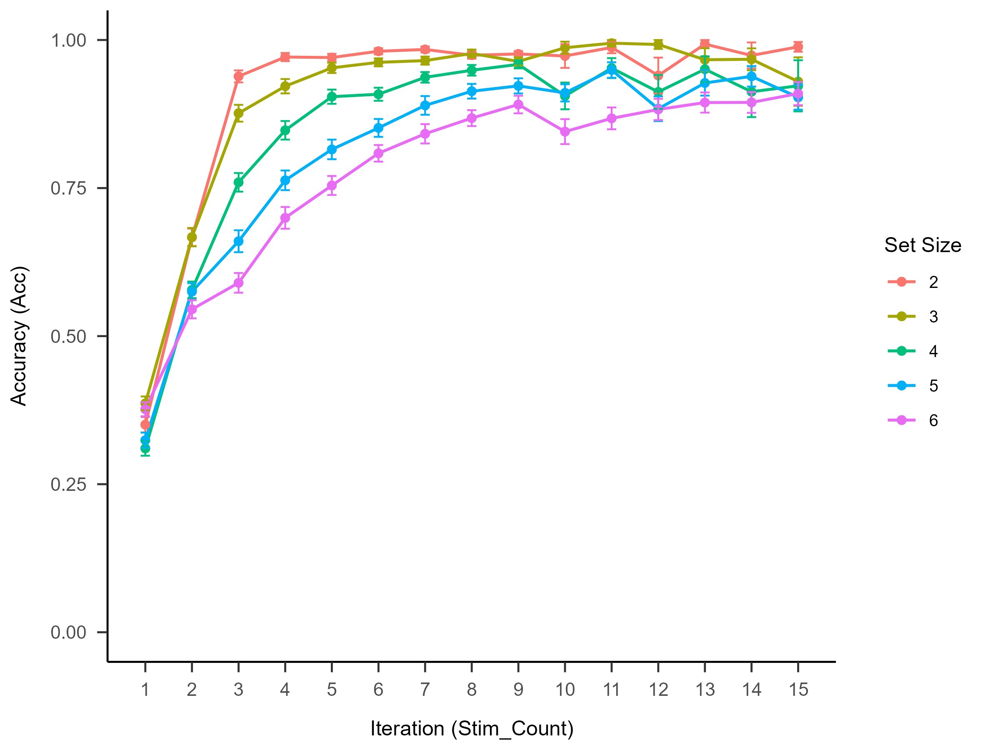
</p>

We have developed three computational models:

1. A standard TD model, featuring only the learning rate and inverse temperature as free parameters.

2. A WM model, where the learning rate is fixed at 1 to represent the exclusive involvement of the working memory system. The free parameters include the decay rate and inverse temperature.

3. An RLWM model, in which the learning rate for the RL system remains a free parameter, while the WM system's learning rate is fixed at 1. The relative contribution of these two systems is controlled by a 'weight' parameter. Notably, decay rate and capacity were excluded as they failed to yield acceptable parameter recovery.

However, none of the aforementioned models successfully replicate the experimental effects observed in human subjects.

## Model

### TD

```r
TD <- function(params){
  ...
  params <- list(
    free = list(alpha = params[1], beta = params[2]),
    fixed = list(Q0 = 0.5),
    constant = list(reset = 0.5)
  )
  ...
}
```

<p align="center">
    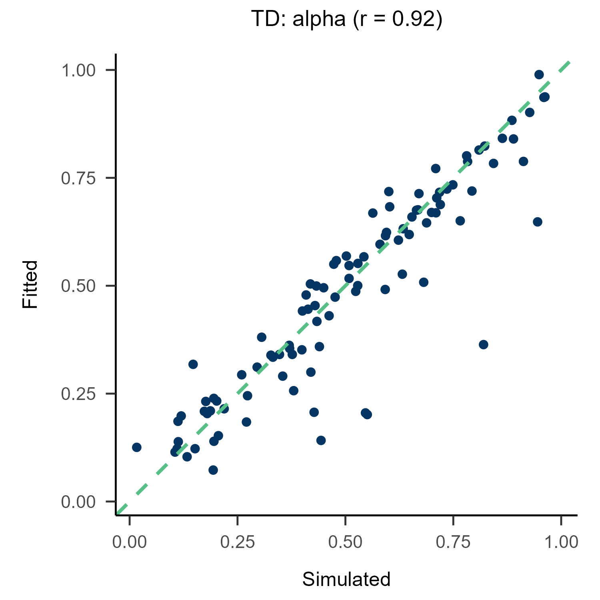
    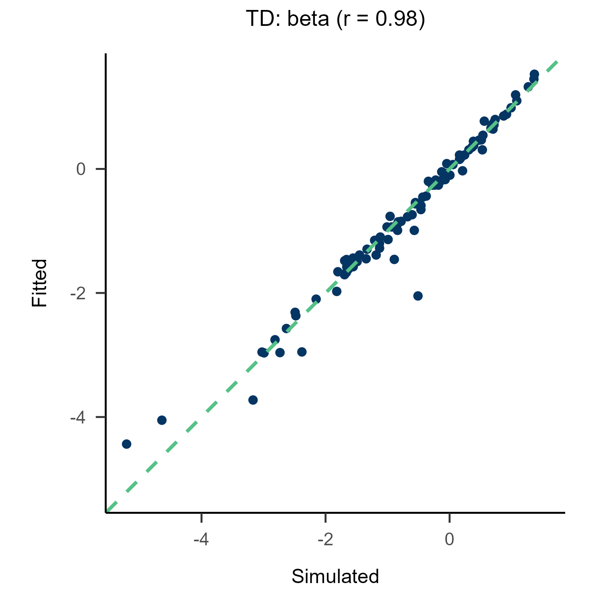
</p>

<p align="center">
    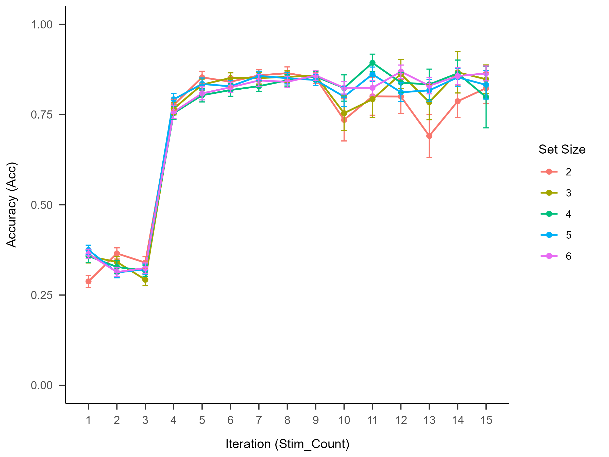
</p>

### WM

```r
WM <- function(params){
  ...
  params <- list(
    free = list(zeta = params[1], beta = params[2]),
    fixed = list(Q0 = 0.5, alpha = 1, weight = 1),
    constant = list(reset = 0.5)
  )
  ...
}
```

<p align="center">
    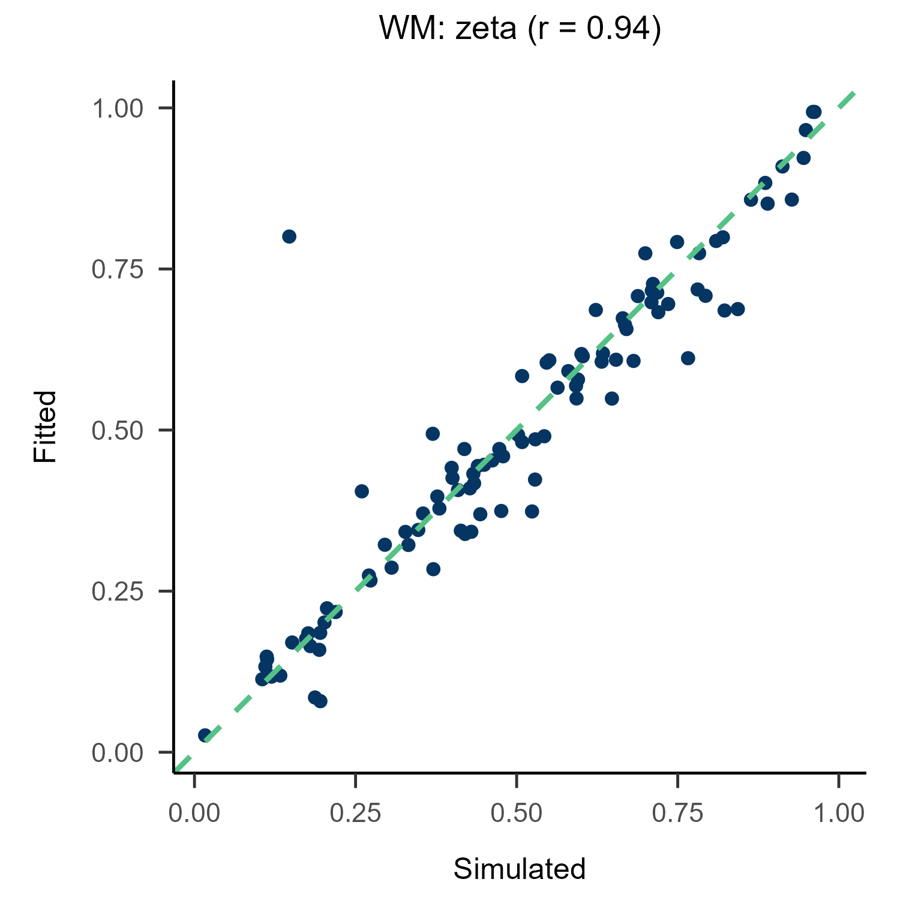
    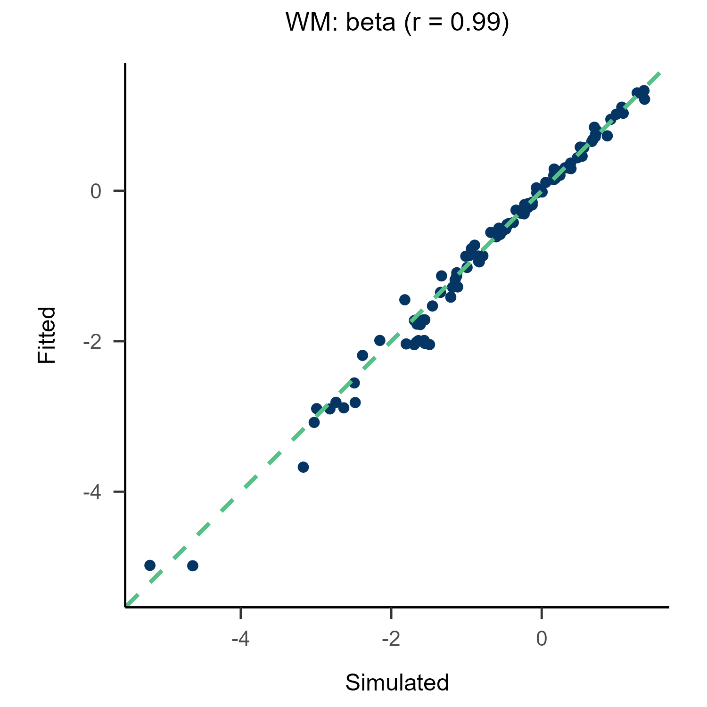
</p>

<p align="center">
    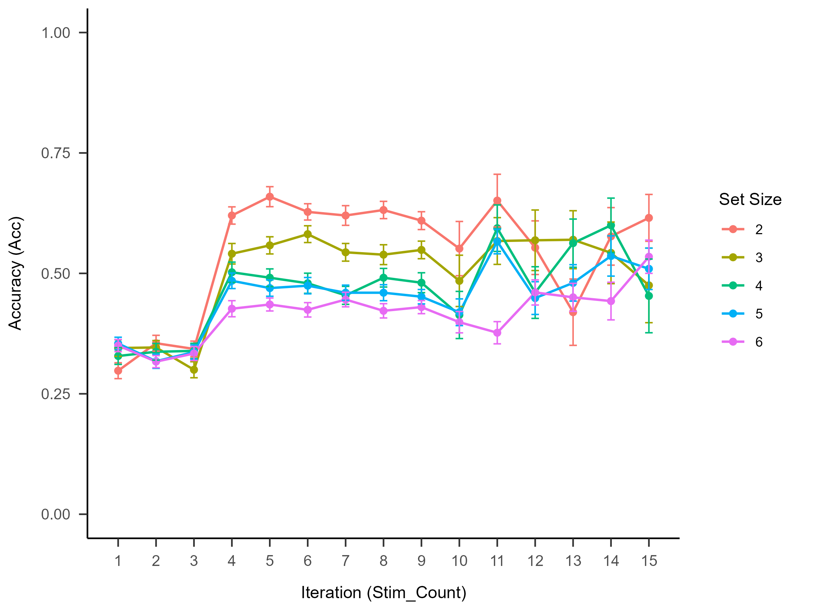
</p>

### RLWM

```r
RLWM <- function(params){
  ...
  params <- list(
    free = list(zeta = params[1], beta = params[2], weight = params[3]),
    fixed = list(Q0 = 0.5),
    constant = list(reset = 0.5)
  )
  ...
}
```

<p align="center">
    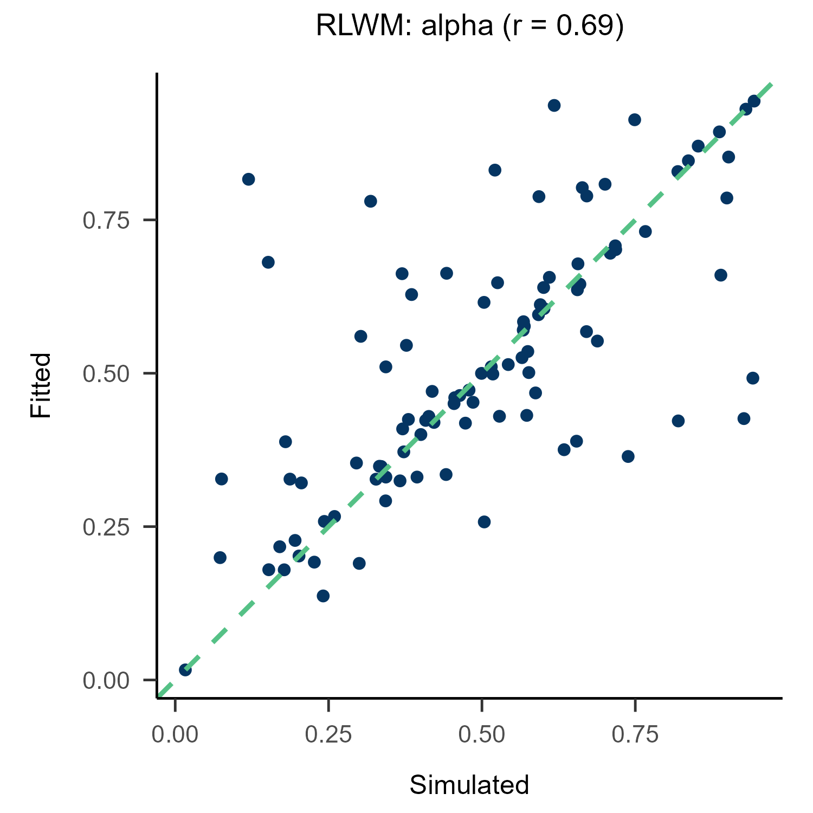
    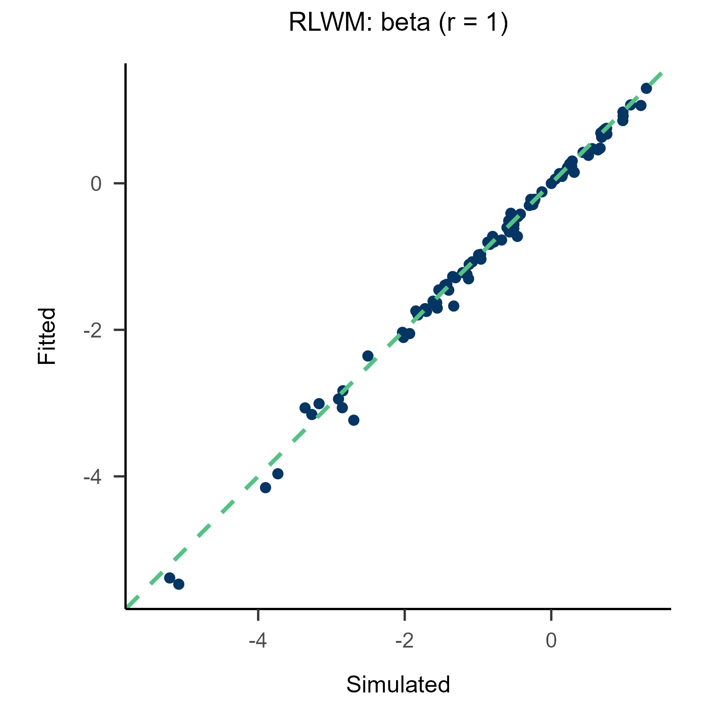
    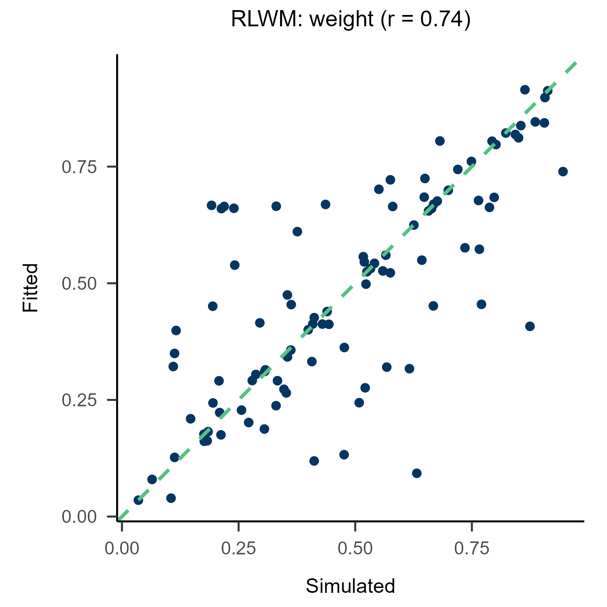
</p>

<p align="center">
    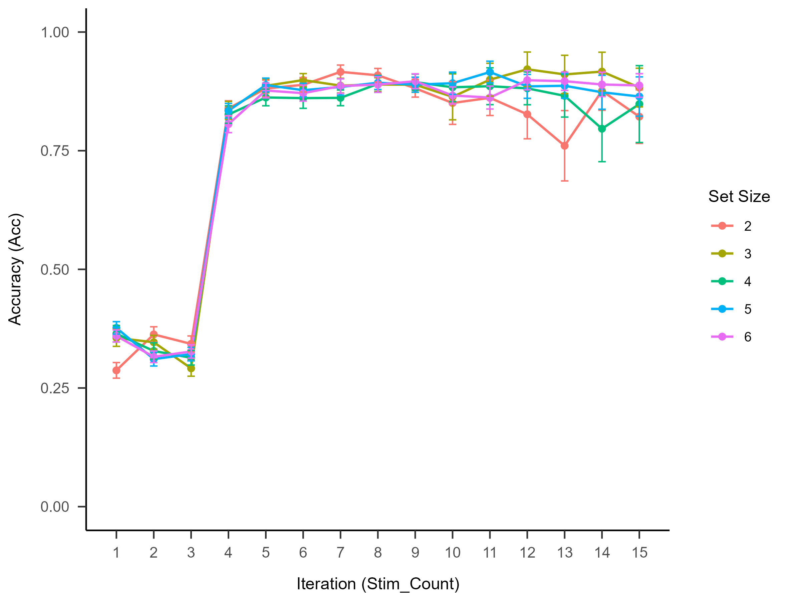
</p>

