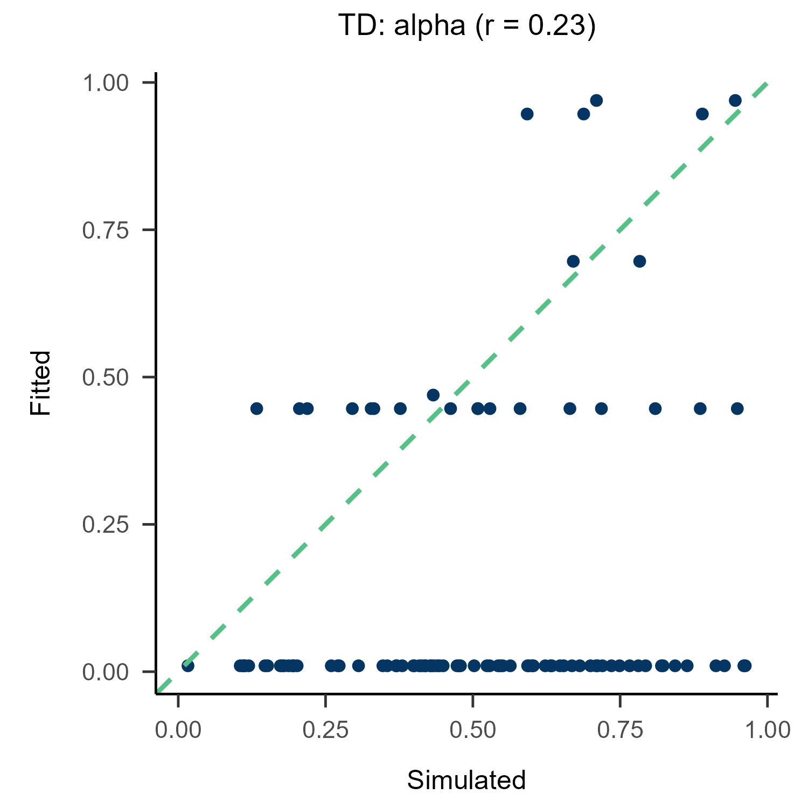
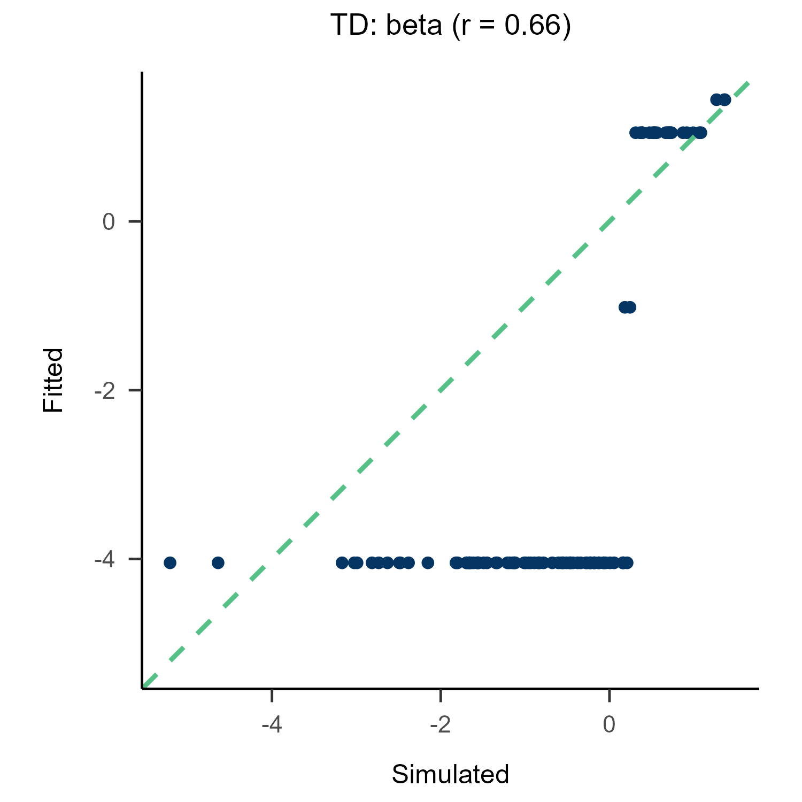
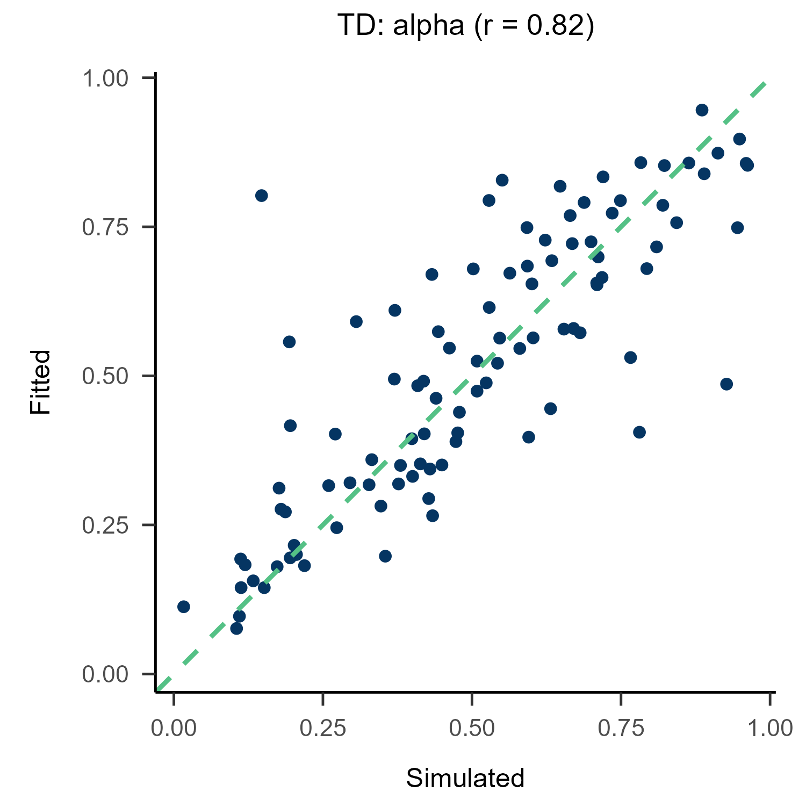
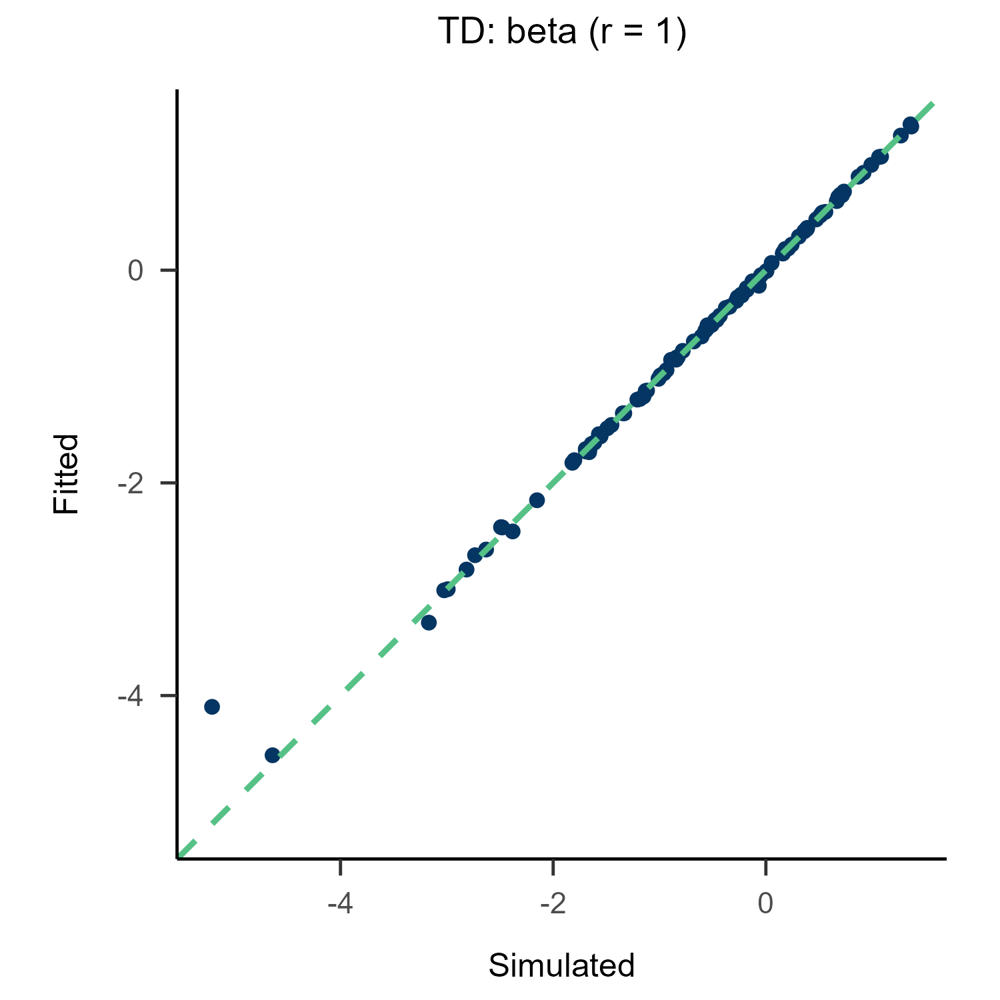

## A Remake of RLWMH

I am a huge fan of Anne G. E. Collins. This repository is a fork of [Collins (2025)](https://doi.org/10.1038/s41562-025-02340-0). (`./RAW`: Contains all original assets, data, and MATLAB scripts from the parent repository)

I will remake the models using my own R package, `multiRL`, guided by my personal understanding of the original MATLAB implementation.

Any novel findings or insights discovered during this process will be documented in this README.

## Padadigm
[Dataset 1](https://github.com/yuki-961004/RLWMH/tree/main/RAW/RLWM/DataSets) is from [Collins and Frank (2012)](https://doi.org/10.1111%2Fj.1460-9568.2011.07980.x)

```
+------------------------------+
|        Computer Screen       |
|                              |
|       +-------------+        |
|       |             |        |
|       |   Stimulus  |        |
|       |    Image    |        |
|       |             |        |
|       +-------------+        |
|                              |
|                              |
|        [J]  [K]  [L]         |
|        Response Keys         |
|                              |
+------------------------------+
```

In each trial, an image is presented, and participants choose between three different response keys. A correct response results in a reward of 1, whereas an incorrect response yields a reward of 0. The working memory load scales up across blocks as the set size (number of stimuli) increases.

## Model

### TD

```r
TD <- function(params){
  ...
  params <- list(
    free = list(alpha = params[1], beta = params[2]),
    constant = list(reset = 0)
  )
  ...
}
```
Under this paradigm, the results of parameter recovery using MLE are catastrophic, whereas the performance with ABC is acceptable.

#### MLE

<p align="center">
    
    
</p>

#### ABC

<p align="center">
    
    
</p>